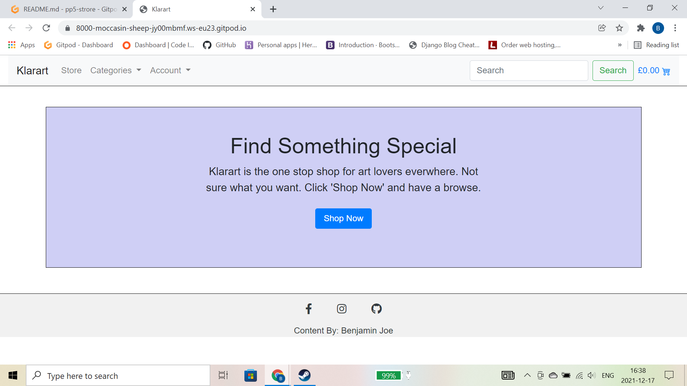
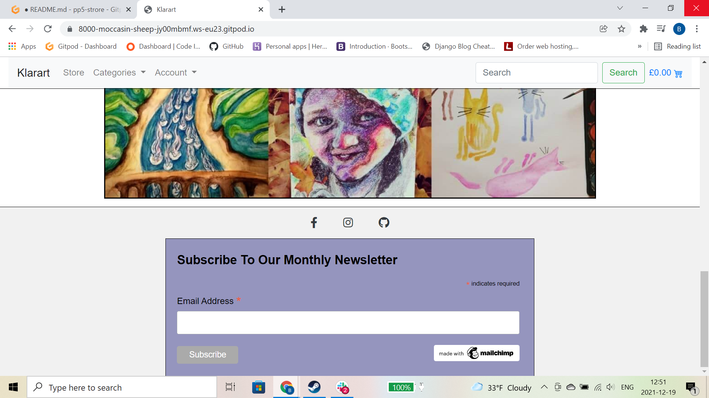
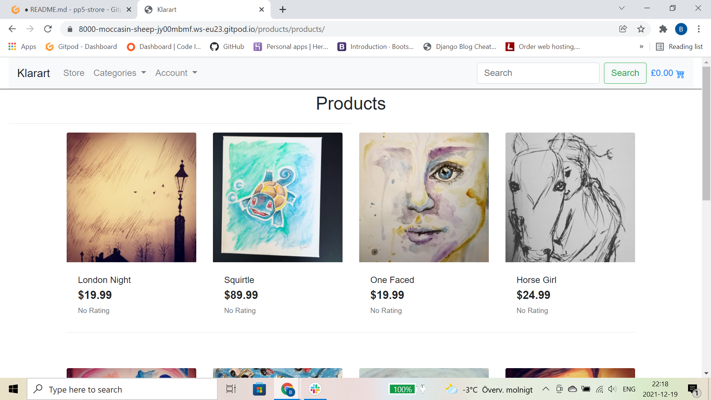
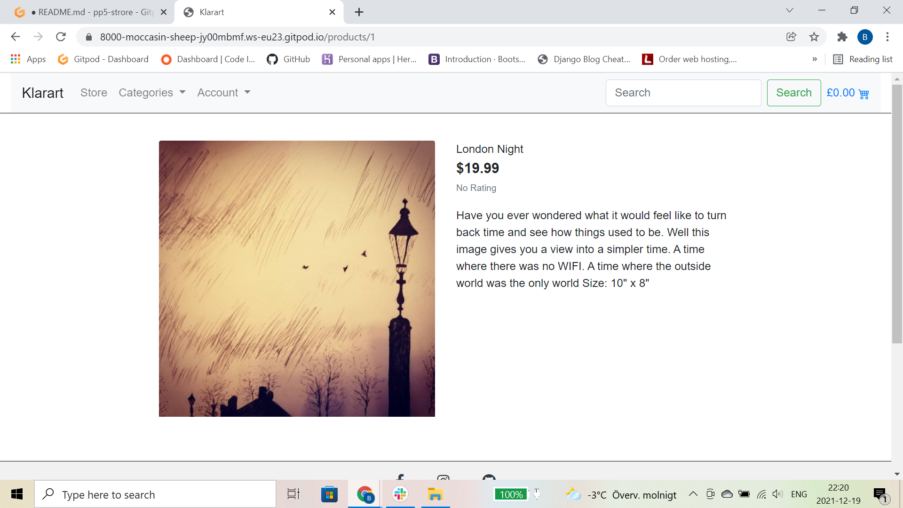
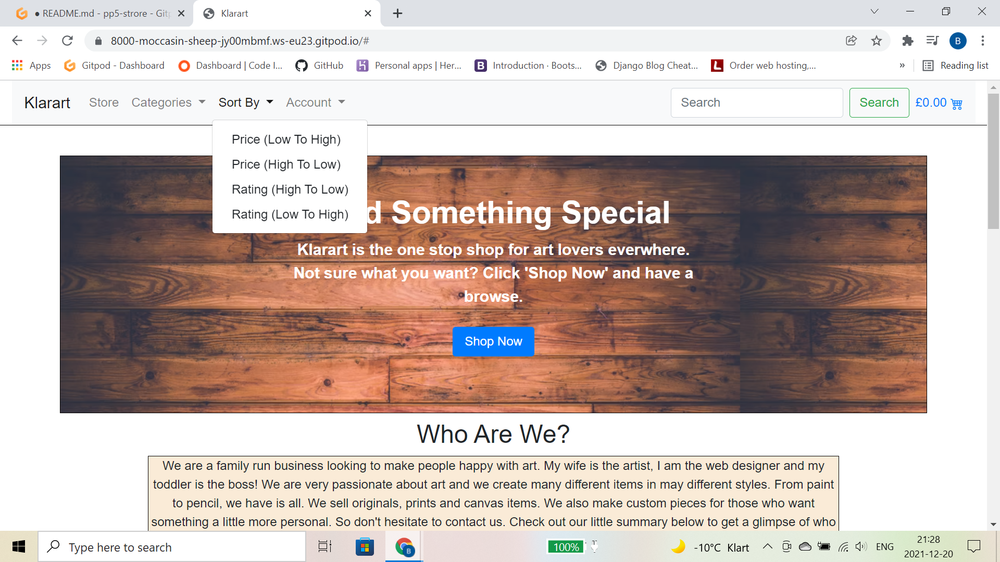
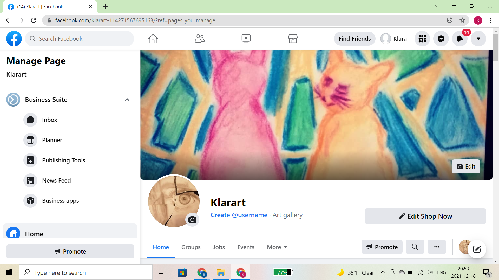
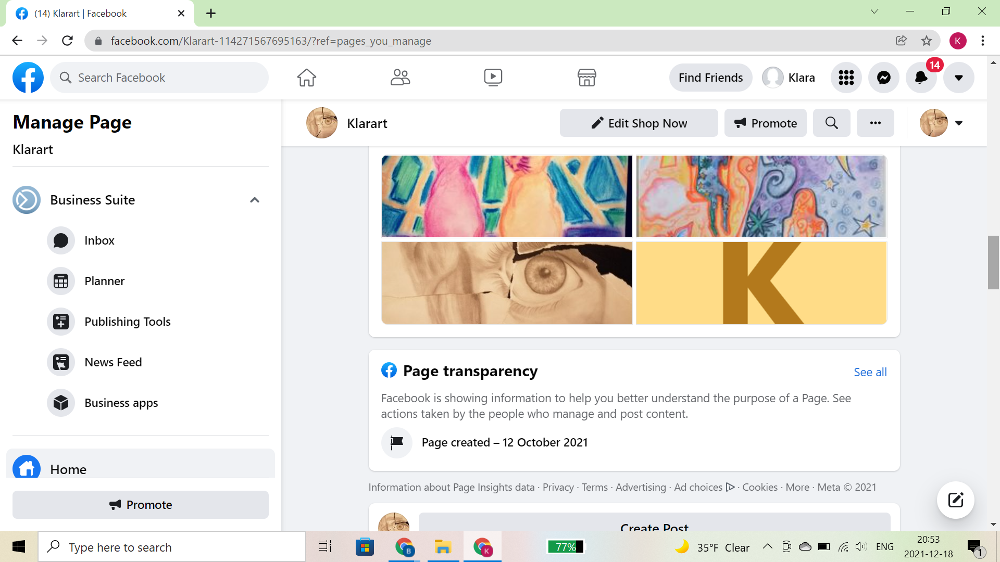

# E-Store()

## Keys

1. [Setup](#setup)
2. [Build](#build)
3. [Installations](#installations)
4. [Marketing](#marketing)
5. [Testing](#testing)
6. [User Stories](#userstories)
7. [Sources](#sources)
8. [Deployment](#deployment)

# Note
The project was not finished in time, I failed to complete adding stripe payments and I did not have a structure for password resets and various minor stylings on the website. Due to be fixed.
Also had trouble with deployment, so the site is not properly deployed. I will try again to pass this project next time

# Setup
To setup this project I followed the Boutique-Ado walkthrough project with Code Institute. Since the whole project is to create an e commerce store, I user the code institute walkthrough as a guide. Having said that I have not copied the Boutique-Ado walkthrough, I have just followed it loosely to ensure I hit all requirements for a passing grade for PP5. Any code that I have taken from Boutique-Ado will be credited appropriately.
To start this project, I first instelled Django and Django allauth. Then created a project called estore using the startproject command. Once that was done, I created a superuser, Ran the port 8000 server and checked everything was working correctly. Then project skeleton was setup and ready to be used.

# Bulid
There are several different app within the project. This was done to help keep the code from getting too cluttered and by keeping things in seperate apps depending on that they are being used for enabled me to find and solve any problems much easier. There is a file in the top level called templates, this is where the allauth templates are stored and where the project base.html file is stored. This file contains all of the content that needs to be spread across all of the webpages. This includes both the navigation bar and the footer.
The first app created was the home app. This is where all of the homepage content is stored. For the homepage there is a container with a small description enticing customers to click the shop now button that will take them to the store page.  
The navigation bar contains, the website name, categories, store, user's account and settings. User basket cost and a search bar for users to search for various items.  
  
The footer for this website contains no surprises, it is where all of the social media links are located. It also contains the mailchimp monthly email sign up box.
  
For the majority of the initial build, I followed the boutique ado walkthrough with Code Institute, This helped me to keep on trach with what needed to be done in order to get this site working. After the footer, I built out the products page, This page contains all of the products available to purchase on the website.
  
After creating the products page, I created the product detail page. This allows users to see products they like in more detail, it also gives them the ability to purchase the item.
  
The navigation bar then got an upgrade. Users now have the ability to filter products by price and rating
  

# Installations
In order to complete this project, quite a few imports were needed, they are all listed below:  
[Python](https://www.python.org/)  
[Django](https://docs.djangoproject.com/en/4.0/)  
[Allauth](https://django-allauth.readthedocs.io/en/latest/installation.html)  
[Pillow](https://pillow.readthedocs.io/en/stable/)  
[Crispy-forms](https://django-crispy-forms.readthedocs.io/en/latest/)  
[Stripe](https://stripe.com/en-se)

# Marketing
The type of clients that this website is aimed at is middle aged women for the most part. This is due to testing. My partner, the artist behind the designs hosted a number of art galleries this year and the majority of customers who purchased items were middle aged women, and also middle aged men buying gifts for their wifes/partners. So in order to best market these products to our clientele we created a business page on facebook, as a lot of the people who purchased items also inquired if our company was on Facebook. We do also have an instagram as it is a great way to advertise to a younger audience. Both links to facebook and instagram are in the footer of this website. Just  incase the facebook business page is no longer valid below are some images of the facbook business page. Another marketing strategy we are using is offering a monthly email keeping our customers up to date with all new items and deals. This too is located in the footer of the website. It only requires an email address to sign up so it is very quick and easy. The final marketing thing we intend to employ is prizes and giveaways. We want to reward customers for their purchases so we intend to imploment discounts and prizes to lucky customers. 
    
      

# Testing
Many different forms of tests were needed to create this website. I made extensive us of Chrome Developer Tools. It was so handy for finding and fixing minor bugs along the way. I also tested my code as went along using code validators, the results will be shown below. W3 proved to be a great source for bug fixing and troubleshooting. As did stack overflow, these sites will be linked to in the sources section.

# User Stories
User stories was a very important side to this project as it helps me to keep on track with what is needed for users and administrators to use the site successfully. Below is an image of user stories needed for the completion of this project.

# Sources
In completing this site I used a variety of sources and guides to help me. The main one I used was Code Institute's boutique ado project walkthrough. This proved very handy in guiding me through this project. A fair amount of the code came from this walkthrough, however I did change and edit things to make them mine. Another valuable source was W3, it was incredibly helpful with bug fixing and just general how to style tips and tricks. Other things used were things like tinypng to shrink images, Stack overflow for tips on solving issues. Slack and a few others, all are linked below. Also any images that aren't my own are noted below

[W3](https://www.w3schools.com/)
[Tinypng](https://tinypng.com/)
[Stack-Overflow](https://stackoverflow.com/)
[Unsplash](https://unsplash.com/)

Photos by:  
[Keith Misner](https://unsplash.com/@keithmisner?utm_source=unsplash&utm_medium=referral&utm_content=creditCopyText)
Image by SK from Pixabay 
Image by analogicus from Pixabay 

# Deployment
